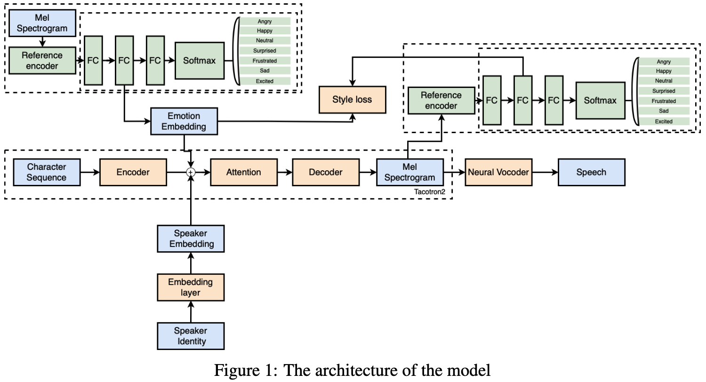
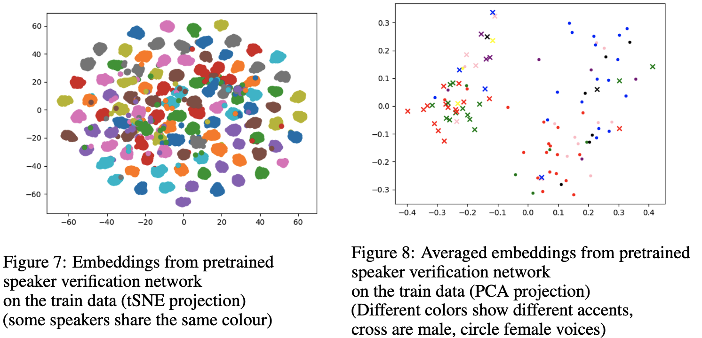
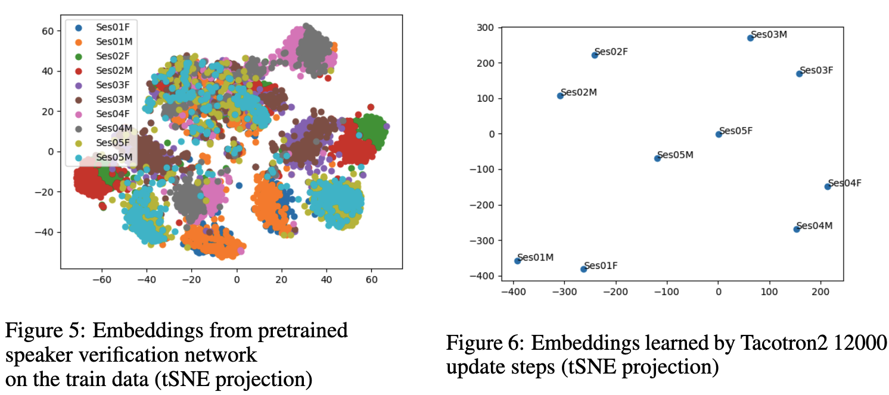
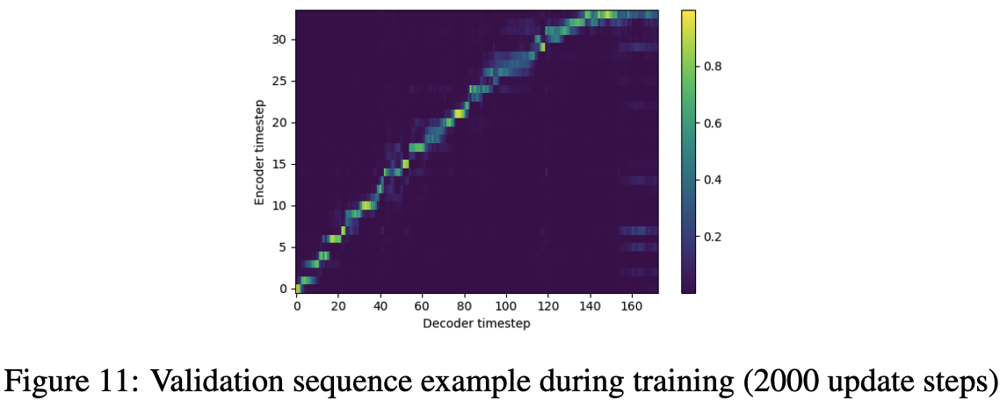

# Conditioned Text-to-Speech End to End System
Read the [report.pdf](report.pdf) for all information about the project.

Our original plan was to reproduce the work in [“Controllable Emotion Transfer For End-to-End Speech Synthesis”](https://ieeexplore.ieee.org/document/9362069), which was done on a single Chinese speaker.

In our setting we used [the multi-speaker English IEMOCAP dataset](https://sail.usc.edu/iemocap/), which means
the system had to be adapted. We modified an already existing implementation of [Tacotron2](https://github.com/NVIDIA/tacotron2) from Nvidia and used already pre-trained vocoder [WaveGlow](https://github.com/NVIDIA/waveglow/tree/5bc2a53e20b3b533362f974cfa1ea0267ae1c2b1).

After initial attempts we realized that the IEMOCAP dataset lacks in the amount
and quality of data for our purpose. Therefore, we pivoted our project and focused
on 3 different approaches to condition Tacotron2 on only the speaker’s identity and
train on the [VCTK dataset](https://datashare.ed.ac.uk/handle/10283/2950). This was done successfully and it even showed
that the approach can be used on unseen speakers.

# Architecture

# VCTK vs IEMOCAP datasets
| VCTK   | IEMOCAP
|-----| -------- |
|   |  |

# [Results](report.pdf): Check out [Tensorboard.dev](https://tensorboard.dev/experiment/vcappjUrQdin2D8aiaPVaA/)

# Demo: Inference on unseen speakers
1. We choose 2 speakers from the bag of unseen speakers: ``p340`` (female), ``p258``(male). 
2. We take 1 audio from each which we call ``reference`` (in this audio the speaker can say anything, we only want the style from it).
3. Input this ``reference`` to the system and other ``text`` we want the system to convert to speech. In this case we choose ``text="Hello, does it work?"``
4. The system outputs an audio with the style from the reference female or male syaing ``"Hello, does it work?"``, specified in ``text``

We compare different ways of embedding the style of the speaker:
### References   

  https://user-images.githubusercontent.com/58919465/190683673-8540aa7f-77cd-488b-8f7b-958eac773ed3.mp4
  
  https://user-images.githubusercontent.com/58919465/190683706-40bbe1b1-3399-4dc0-b648-dad7040f985c.mp4

### Trainable Embedding

  https://user-images.githubusercontent.com/58919465/190683723-da930bd8-1f08-472e-9d3e-50bbfef0adb8.mp4
  
  https://user-images.githubusercontent.com/58919465/190683759-2f37ba33-9e18-4b94-9d5c-d50437db363f.mp4

### Fixed Embedding

  https://user-images.githubusercontent.com/58919465/190683778-7d7544cf-d51d-44f2-844a-9837dcaf536a.mp4
  
  https://user-images.githubusercontent.com/58919465/190683791-6db11fa9-be36-48e9-8370-bf706f49afe4.mp4

### Global Style Tokens

  https://user-images.githubusercontent.com/58919465/190683814-860a1293-1479-430e-ba16-e040054c069b.mp4
  
  https://user-images.githubusercontent.com/58919465/190683836-9359d2ec-73d5-42ed-ab15-252e98c423eb.mp4

# Credits
It builds upon the following repositories:
1. https://github.com/NVIDIA/tacotron2
2. https://github.com/NVIDIA/waveglow 
3. https://github.com/resemble-ai/Resemblyzer
